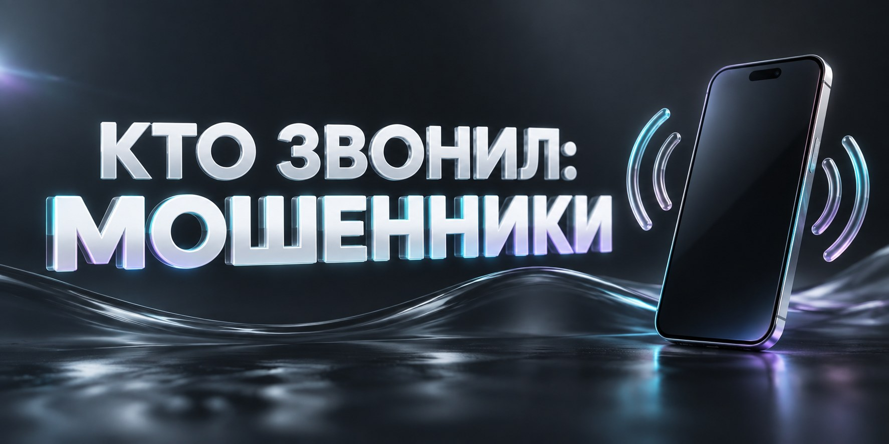

# Кто звонил: проверка на мошенников

Запрос **«кто звонил — мошенники или обычная организация»** появляется после незнакомого вызова, пропущенного звонка или сообщения с просьбой перезвонить. Номер можно проверить по открытым упоминаниям и понять, связан ли он с компанией, объявлениями, услугами, массовыми звонками или похожими жалобами пользователей.

<a href="https://probivtg.pro/?utm_source=github&utm_medium=organic&utm_campaign=proverka-moshennika&utm_content=kto-zvonil-moshenniki&utm_term=top&ref=github_proverka-moshennika_kto-zvonil-moshenniki_top"><strong>Узнать, кто звонил</strong></a>

## Начните с точного номера

Введите телефон с кодом страны. Если вызов отображался в местном формате, сохраните и его, но основной поиск выполняйте по полной записи. Зафиксируйте время звонка, был ли вызов повторным и пришло ли после него SMS или сообщение в мессенджере.

Не ориентируйтесь только на подпись в телефоне: она может быть добавлена другими пользователями или устареть. Полезнее сравнить несколько источников — официальный сайт, карточку организации, объявление, профиль и свежие отзывы.

## Какие результаты встречаются

Номер может вести к магазину, службе доставки, мастеру, колл-центру, объявлению или публичному профилю. Иногда рядом указаны сайт, адрес, email и название компании. Для частного контакта чаще находятся объявления, username и страницы в социальных сетях.

Если люди описывают одинаковый сценарий — представление службой безопасности, просьбу назвать код, предложение удалённого доступа или срочный перевод — сравните даты и детали. Один комментарий может ошибаться, а повторяющийся свежий сюжет даёт больше контекста.

## Как отличить компанию от подмены

Найдите официальный сайт организации и опубликованный на нём телефон. Сравните домен, название и регион. Даже если звонящий правильно назвал компанию, входящий номер может не принадлежать ей. Для обратной связи используйте контакт с официального сайта или приложения.

Проверьте адрес ссылки из сообщения. Подмена одной буквы или дополнительное слово в домене создают внешне похожую страницу. Если человек предлагает перейти в Telegram, отдельно проверьте его username и фотографию профиля.

## Если звонок был пропущен

Сначала посмотрите, есть ли номер в открытых карточках и объявлениях. Для международного или короткого вызова проверьте код региона и формат. Необязательно перезванивать: название компании или тип звонка часто понятны по открытым записям.

<a href="https://probivtg.pro/?utm_source=github&utm_medium=organic&utm_campaign=proverka-moshennika&utm_content=kto-zvonil-moshenniki&utm_term=middle&ref=github_proverka-moshennika_kto-zvonil-moshenniki_middle"><strong>Проверить неизвестный номер</strong></a>

Если номер нигде не встречается, сохраните его и проверьте позже вместе с новым сообщением или повторным вызовом. Дополнительный username, email или ссылка обычно дают больше результатов, чем несколько одинаковых запросов по телефону.

## Короткая схема проверки

1. Найдите прямые упоминания номера.
2. Отделите компании и объявления от комментариев.
3. Сравните свежие даты и регион.
4. Проверьте сайт, username и другие контакты.
5. Сохраните только подтверждённые связи.

Результат удобно записать одной строкой: номер, вероятная категория звонка, источник, дата и связанный сайт или профиль. Так информация остаётся понятной и её легко перепроверить.

## Вопросы после неизвестного звонка

**Можно ли узнать владельца номера?** Иногда телефон опубликован компанией или пользователем, но закрытые данные из обычного поиска не появляются.

**Почему один номер подписан по-разному?** Он мог менять владельца, использоваться колл-центром или фигурировать в разных объявлениях.

**Стоит ли доверять названию, которое показал телефон?** Его лучше сверить с официальным сайтом и свежими упоминаниями.

**Что делать с Telegram username из сообщения?** Проверить его отдельно и сравнить связанные страницы, аватар и контакты.

## Пример определения категории звонка

Один и тот же номер звонит несколько раз, но сообщение не оставляет. В открытых карточках он указан как телефон сервисной компании, а свежие комментарии описывают подтверждение заказов. Сверьте регион, официальный сайт и время работы: если детали совпадают, категория звонка становится понятнее даже без обратного вызова.

Другой случай — номер встречается только в недавних жалобах с одинаковым сценарием и не указан ни на одном официальном ресурсе. Сохраните даты и формулировки, но не считайте комментарии доказательством личности звонящего. Практический вывод здесь относится к характеру вызова и способу дальнейшей связи, а не к установлению владельца.

<a href="https://probivtg.pro/?utm_source=github&utm_medium=organic&utm_campaign=proverka-moshennika&utm_content=kto-zvonil-moshenniki&utm_term=bottom&ref=github_proverka-moshennika_kto-zvonil-moshenniki_bottom"><strong>Перейти к проверке звонка</strong></a>

